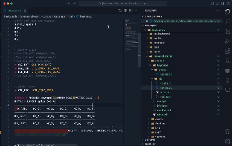

# QMK Action Button

Adds context button to current open file to compile or flash your QMK firmware based on the current open file.

Find it on [GitHub](https://github.com/lukevanlukevan/qmk-action-button).

Find it on [VS Code Marketplace](https://marketplace.visualstudio.com/items?itemName=LukeVan.qmk-action-button)

## Features

When editing a file, a button in the top right is created to both flash and compile your firmware. This saves the time of retyping the commands in the command line.

-   Pick between Flash and Compile.
-   Choose to paste and execute or just paste it into the terminal. (Extension settings)

## Known Issues

Does not currently work with Docker containers or GitHub Codespaces.

## Changelog

### 0.1.3

-   Fixed error causing button to only show on specific focus. Now persists if focus leaves text editor.

### 0.1.2

-   Added settings to show options for flashing sides.
-   Added settings to show options extra arguments for compile and flash commands.

### 0.1.1

-   Added settings to choose between "Paste and execute" and "Paste only".

### 0.1.0

-   If inside a keyboard folder but not a keymap, prompt for keymap to use.
-   Changed terminal name from "QMK Compile Terminal" to "QMK Terminal"

### 0.0.1

-   Initial release of QMK Action Button.

## **Enjoy!**

